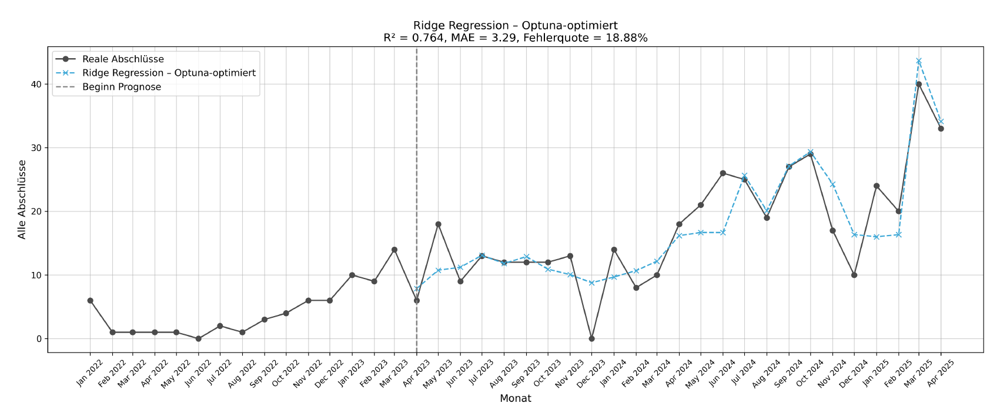
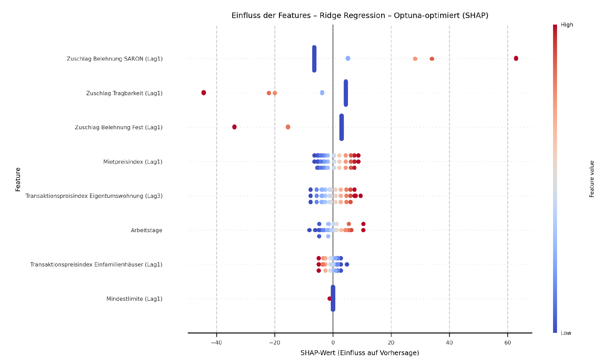

# Time-Series Forecasting Pipeline

End-to-end pipeline for predicting monthly mortgage-closure volumes in a Swiss online-banking channel, using interest-rate indicators and market factors as predictors for proactive capacity planning.

`Python` `scikit-learn` `XGBoost` `SARIMAX` `Optuna` `SHAP` `Time-Series`

> **Best result: R² 0.764, MAE 3.29, MAPE 18.88% with an Optuna-tuned Ridge model.** Structural analysis revealed two distinct customer channels, modelled separately for more stable and more interpretable forecasts.

---

## Results

Optuna-optimized models under expanding-window validation:

| Model | R² | MAE | MAPE |
|---|---|---|---|
| Ridge Regression | **0.764** | **3.29** | **18.88%** |
| Lasso Regression | 0.705 | 3.57 | 21.05% |
| XGBoost | 0.617 | 4.10 | 23.52% |
| Linear Regression | 0.504 | 4.63 | 26.72% |
| SARIMAX | 0.466 | 4.97 | 29.24% |

*MAE is expressed in monthly closures. MAPE = mean absolute percentage error.*

> Metrics above come from the **real (confidential) dataset**. The repository ships **synthetic data** so the pipeline runs end-to-end out of the box. See [Reproducibility](#reproducibility) and [Limitations](#limitations).

## Approach

| Stage | What was done |
|---|---|
| **Feature selection** | Five methods compared: Mutual Information, SelectKBest, RFE, Lasso, Random Forest |
| **Baseline modelling** | Five model families under 80/20 split and expanding-window validation |
| **Hyperparameter optimization** | Optuna for feature refinement and parameter search across all models |
| **Model interpretation** | SHAP analysis and what-if scenarios for actionable business insights |

## Key Findings

**Ridge Regression outperforms all other model families.** Under Optuna-optimized expanding-window validation, Ridge achieves R² 0.764 and MAE 3.29, outperforming XGBoost (R² 0.617) and SARIMAX (R² 0.466). The L2 regularization handles multicollinearity in the interest-rate features more effectively than the other approaches.

**Channel structure matters more than model complexity.** Exploratory analysis revealed that two customer channels behave structurally differently. Splitting into channel-specific Ridge models improved interpretability and produced more stable forecasts than a single combined model.

**SARON surcharge and rent-price index are the strongest predictors.** SHAP analysis identified the SARON reward surcharge (Lag1) and the rent-price index (Lag3) as the features with the largest influence on predicted volume. These are concrete, actionable levers for demand management.

**Expanding-window validation is essential for honest time-series evaluation.** The 80/20 static split significantly overestimates real-world performance. Expanding-window validation mirrors the actual deployment scenario and produces a more reliable estimate of production accuracy.

## Visualisations

Ridge Regression forecast vs. actual monthly closure volumes (R² 0.764, MAE 3.29, MAPE 18.88%, Optuna-optimized expanding-window validation).



SHAP feature importance for the Ridge model on the Brokermarket/Swissfex channel. The SARON reward surcharge (Lag1) has the strongest individual influence on predicted closure volume, followed by the rent-price index (Lag3) and working days.



## Reproducibility

**Run**

```bash
git clone https://github.com/JananthanU/time-series-forecasting-pipeline
cd time-series-forecasting-pipeline
pip install -r requirements.txt
jupyter notebook        # runs out of the box on the bundled synthetic data
```

Run the notebooks in `notebooks/` in order:

1. `01_feature_selection.ipynb`: feature selection comparison
2. `02_baseline_split.ipynb`: baseline models, 80/20 split
3. `03_baseline_expanding_window.ipynb`: baseline models, expanding-window validation
4. `04_optuna_expanding_window.ipynb`: Optuna-tuned final models

**Data**

The repository ships a **synthetic dataset** at `data/data.csv` so the full pipeline is runnable without access to confidential data. To reproduce the reported business metrics, replace it with a real dataset in the same column format.

## Limitations

- The headline metrics (R² 0.764, etc.) were obtained on a **confidential real dataset** that cannot be published. The bundled synthetic data reproduces the *pipeline*, not the *numbers*. Plots in `reports/figures/` are illustrative, while `assets/` shows the real-data results.
- The 80/20 static split is included only for comparison and is **not** recommended for production evaluation of time-series models.
- Results reflect a single online-banking channel and time range, transfer to other products or periods would require re-validation.
